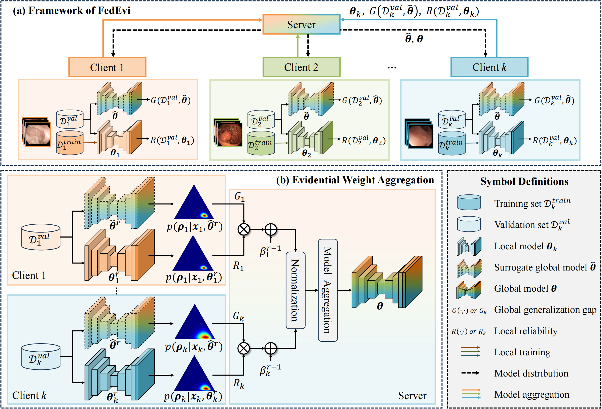
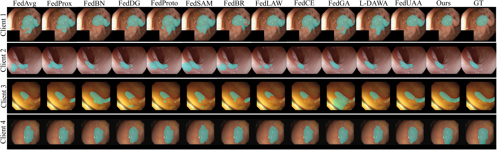

# FedEvi
This is the official Pytorch implementation of our MICCAI 2024 paper "FedEvi: Improving Federated Medical Image
Segmentation via Evidential Weight Aggregation".



## 💻 Requirements
Please review the following requirements and install the packages listed in the `requirements.txt`
```bash
$ pip install --upgrade pip
$ pip install -r requirements.txt
```

## 📚 Data Preparation
### Datasets
The data source and sample sizes (train/val/test) of multi-center datasets utilized in our study are summarized as follows:

| Dataset | Endoscopic Polyp Dataset | Prostate MRI Dataset | Retinal Fundus Dataset |
| :---: | :---: | :---: | :---: |
| Client 1 | Kvasir [1]: 700/100/200 | BIDMC [5]: 207/16/38 | Drishti-GS [8]: 71/10/20 |
| Client 2 | ETIS [2]: 138/19/39| BMC [6]: 276/38/70 | RIM-ONE-r3 [9]: 113/15/31 | 
| Client 3 | ColonDB [3]: 267/37/75 | HK [5]: 121/11/26 | REFUGE (Zeiss) [10]: 280/40/80 |
| Client 4 | ClinicDB [4]: 429/61/122 | I2CVB [7]: 358/28/82 | REFUGE (Canon) [10]: 280/40/80 |
| Client 5 | - | RUNMC [6]: 295/51/75 | BinRushed [11]: 67/9/19 |
| Client 6 | - | UCL [5]: 138/13/24 | Margabia [11]: 137/19/39|

Download links: [endoscopic polyp dataset](https://drive.google.com/file/d/1_sf0W4QmQn-rY7P_-OJMVZn7Hf50jD-w/view?usp=drive_link), [prostate MRI dataset](https://liuquande.github.io/SAML/), and retinal fundus dataset ([client 1-4](https://drive.google.com/file/d/1p33nsWQaiZMAgsruDoJLyatoq5XAH-TH/view), [client 5-6](https://zenodo.org/records/6325549))

### Data Preprocessiong
- Download the required datasets and unzip them to `../Dataset/` folder. Please reorganize the dataset according to the structure specified in the `tree.txt` file.
- Navigate to the `data/` folder and run `python prepare_dataset.py` to transform the original dataset into `*.npy` format. 

### Data Split
Please navigate to the `data/` folder and run `python data_split.py`  to divide the data into training, validation, and test sets at a ratio of 7:1:2. Furthermore, the split ratio can be adjusted within this script to suit your specific requirements.

## 🚀 Usage
For endoscopic polyp segmentation, the command for execution is as follows:
```bash
$ CUDA_VISIBLE_DEVICES=3 python main_seg_al.py --dataset Polyp --fl_method FedEvi --deterministic True --seed 3 --max_round 200 --gamma 0.99 --annealing_step 10
```

## 👀 Visualization


## 🌟 Citation
If you find this work helpful, please cite 
```
@inproceedings{chen2024fedevi,
  title={FedEvi: Improving Federated Medical Image Segmentation via Evidential Weight Aggregation},
  author={Chen, Jiayi and Ma, Benteng and Cui, Hengfei and Xia, Yong},
  booktitle={International Conference on Medical Image Computing and Computer-Assisted Intervention},
  year={2024},
  organization={Springer}
}
```

## 🙏 Acknowledment
The codebase is adapted from [FedDG](https://github.com/liuquande/FedDG-ELCFS), [FedLC](https://github.com/jcwang123/FedLC), and [EDL](https://github.com/dougbrion/pytorch-classification-uncertainty). We sincerely appreciate their insightful work and valuable contributions. Additionally, we express our gratitude to the researchers listed in [1-11] for generously sharing their datasets for public use.

## References
[1] Jha, D., Smedsrud, P.H., Riegler, M.A., Halvorsen, P., de Lange, T., Johansen, D., Johansen, H.D.: Kvasir-seg: A segmented polyp dataset. In: MMM. (2020)

[2] Silva, J., Histace, A., Romain, O., Dray, X., Granado, B.: Toward embedded detection of polyps in wce images for early diagnosis of colorectal cancer. Int. J. Comput. Assist. Radiol. Surg. 9, 283–293 (2014)

[3] Tajbakhsh, N., Gurudu, S.R., Liang, J.: Automated polyp detection in colonoscopy videos using shape and context information. IEEE Trans. Med. Imaging. 35(2), 630–644 (2015)

[4] Bernal, J., Sánchez, F.J., Fernández-Esparrach, G., Gil, D., Rodríguez, C., Vilariño, F.: Wm-dova maps for accurate polyp highlighting in colonoscopy: Validation vs. saliency maps from physicians. Comput. Med. Imag. Grap. 43, 99–111 (2015)

[5] Litjens, G., Toth, R., Van De Ven, W., Hoeks, C., Kerkstra, S., Van Ginneken, B., Vincent, G., Guillard, G., Birbeck, N., Zhang, J., et al.: Evaluation of prostate segmentation algorithms for mri: the promise12 challenge. Med. Image. Anal. 18(2), 359–373 (2014)

[6] Bloch, N., Madabhushi, A., Huisman, H., Freymann, J., Kirby, J., Grauer, M., Enquobahrie, A., Jaffe, C., Clarke, L., Farahani, K.: Nci-isbi 2013 challenge: automated segmentation of prostate structures. TCIA 370(6), 5 (2015)

[7] Lemaître, G., Martí, R., Freixenet, J., Vilanova, J.C., Walker, P.M., Meriaudeau, F.: Computer-aided detection and diagnosis for prostate cancer based on mono and multi-parametric mri: a review. Comput. in Bio. and Med. 60, 8–31 (2015)

[8] Sivaswamy, J., Krishnadas, S., Chakravarty, A., Joshi, G., Tabish, A.S., et al.: A comprehensive retinal image dataset for the assessment of glaucoma from the optic nerve head analysis. JSM Biomedical Imaging Data Papers 2(1), 1004 (2015)

[9] Fumero, F., Alayón, S., Sanchez, J.L., Sigut, J., Gonzalez-Hernandez, M.: Rim-one: An open retinal image database for optic nerve evaluation. In: CBMS. (2011)

[10] Orlando, J.I., Fu, H., Breda, J.B., Van Keer, K., Bathula, D.R., Diaz-Pinto, A., Fang, R., Heng, P.A., Kim, J., Lee, J., et al.: Refuge challenge: A unified framework for evaluating automated methods for glaucoma assessment from fundus photographs. Med. Image. Anal. 59, 101570 (2020)

[11] Almazroa, A., Alodhayb, S., Osman, E., Ramadan, E., Hummadi, M., Dlaim, M., Alkatee, M., Raahemifar, K., Lakshminarayanan, V.: Retinal fundus images for glaucoma analysis: the riga dataset. In: Medical Imaging 2018: Imaging Informatics for Healthcare, Research, and Applications. (2018)